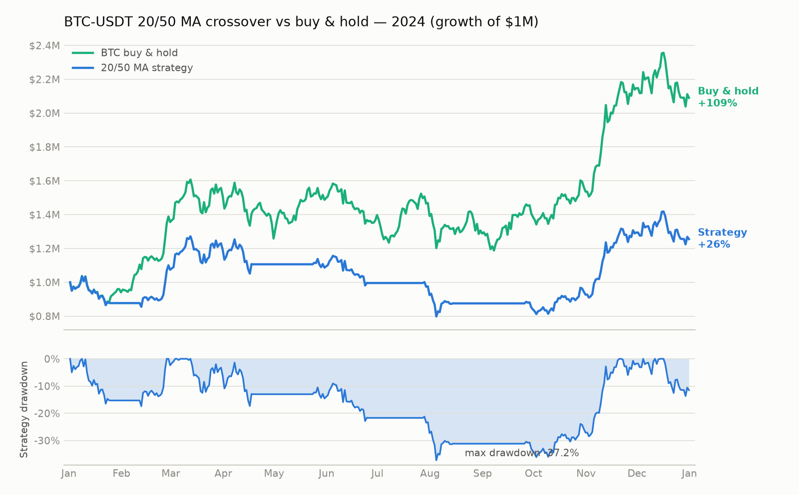

# Vibe-Trading evaluation: BTC MA backtest + alpha zoo bench

Trial of [`vibe-trading-ai`](https://pypi.org/project/vibe-trading-ai/) 0.1.11
(HKUDS / [Vibe-Trading](https://github.com/HKUDS/Vibe-Trading)) in a sandboxed
cloud session on 2026-07-13, driving the two commands from the task:

```bash
vibe-trading run -p "Backtest a BTC-USDT 20/50 moving-average strategy for 2024, summarize return and drawdown, then export the report"
vibe-trading alpha bench --zoo gtja191 --universe csi300 --period 2018-2025 --top 20
```

## TL;DR

| Command | Outcome |
|---|---|
| `vibe-trading run -p "Backtest BTC-USDT 20/50 MA …"` | LLM agent unavailable (no OpenAI-compatible key in env) — **ran the same backtest directly on the package's built-in engine** with real OKX data. Results below. |
| `alpha bench --zoo gtja191 --universe csi300` | Blocked: CSI300 universe requires a personal `TUSHARE_TOKEN` (free registration at tushare.pro). |
| `alpha bench --universe btc-usdt` fallback | Rejected by design: cross-sectional IC needs ≥2 instruments. |
| `alpha bench --universe sp500` fallback | ✅ Ran to completion: 151/191 alphas tested over 2018–2025 in ~8 min. **None survive on the S&P 500** — best IR 0.098, all top-20 categorized "dead". Details below. |

## BTC-USDT 20/50 MA crossover — 2024 backtest results

Long while SMA20 > SMA50, flat otherwise. Daily OKX candles, $1M initial
capital, 0.1% commission. Data fetched from 2023-11-13 so the 50-day MA is
fully warmed up by Jan 1 — the strategy is live (and in the market) for all
of 2024; no trades occur before 2024.



| Metric | Strategy | BTC buy & hold |
|---|---|---|
| Total return 2024 | **+25.6%** | +109.0% |
| Max drawdown | **−37.2%** | −26.1% |
| Sharpe (daily, √365) | 0.71–0.76 | — |
| Sortino / Calmar | 0.89 / 0.59 | — |
| Trades (round trips) | 5 | — |
| Win rate | 40% | — |
| Profit factor | 1.82 | — |
| Avg holding period | 47 days | — |
| Final equity | $1,255,502 | $2,090,222 |

**Summary.** The 20/50 crossover captured the Feb–Apr and Oct–Dec 2024
up-trends (the two winning trades: +27.1% and +44.7%) but was whipsawed three
times in the choppy May–Sep range (−12.0%, −9.6%, −11.9%), each time selling
after a decline and re-buying higher. In a year when BTC more than doubled,
the strategy underperformed buy-and-hold by ~83 points *and* had a deeper max
drawdown (−37.2% vs −26.1%) because the whipsaw losses were realized, not just
marked. Classic trend-following trade-off: the crossover only pays for itself
in years with sustained bear legs to sidestep; 2024 had none.

Trade log:

| # | Entry | Exit | Days | P&L |
|---|---|---|---|---|
| 1 | 2024-01-02 @ $45,207 | 2024-01-25 @ $39,781 | 23 | −12.0% |
| 2 | 2024-02-12 @ $49,942 | 2024-04-18 @ $63,466 | 66 | +27.1% |
| 3 | 2024-05-24 @ $68,366 | 2024-06-25 @ $61,790 | 32 | −9.6% |
| 4 | 2024-07-28 @ $67,684 | 2024-08-15 @ $59,646 | 18 | −11.9% |
| 5 | 2024-09-26 @ $65,267 | 2024-12-31 @ $94,443 (end) | 96 | +44.7% |

Everything needed to reproduce is in [`btc-ma-20-50-2024/`](btc-ma-20-50-2024/):
`config.json` + `code/signal_engine.py` (the engine's inputs), the engine's
exported report `run_card.md` (with config/strategy/artifact SHA-256 hashes),
and `artifacts/` (equity curve, trades, positions, metrics, raw OHLCV). Re-run
with:

```bash
python <site-packages>/backtest/runner.py btc-ma-20-50-2024
# (set VIBE_TRADING_ALLOWED_RUN_ROOTS to the parent directory first)
```

## Alpha zoo bench — GTJA-191 on the S&P 500, 2018–2025

The requested CSI300 run needs a `TUSHARE_TOKEN`, so the bench ran on the
`sp500` universe instead (~500 current constituents, daily bars via the
package's loader fallback chain, ~476 s wall time):

```bash
vibe-trading alpha bench --zoo gtja191 --universe sp500 --period 2018-2025 --top 20
```

**Result: the GTJA-191 zoo is effectively dead on US large caps.** 151 alphas
tested, 40 skipped (their formulas need an `amount`/turnover column the US
panel doesn't provide). The best alpha by information ratio:

| # | Alpha | Theme | IC mean | IC std | IR | IC+ ratio |
|---|---|---|---|---|---|---|
| 1 | gtja191_171 | microstructure | 0.0143 | 0.146 | 0.098 | 0.550 |
| 2 | gtja191_117 | volume, momentum | 0.0155 | 0.162 | 0.096 | 0.530 |
| 3 | gtja191_091 | volume, reversal | 0.0124 | 0.131 | 0.095 | 0.529 |
| 4 | gtja191_102 | volume | 0.0065 | 0.075 | 0.087 | 0.529 |
| 5 | gtja191_004 | momentum, volume | 0.0096 | 0.112 | 0.086 | 0.530 |

Every one of the top 20 is categorized **"dead"** by the bench (IC means
around 0.01, IRs below 0.1, hit rates barely above 52%). That is a plausible
result, not a tool failure: these factors were mined on China A-shares
(retail-heavy, short-sale-constrained, pre-2017 data); their edge does not
transfer to the 2018–2025 S&P 500. Two caveats the tool itself flags:
constituents come from the *current* S&P 500 list (survivorship bias inflates
IC if anything, making the "dead" verdict stronger), and the 40 skipped
formulas were never scored.

The tool's exported report is in
[`alpha-bench/alpha_bench_20260713T195923Z.html`](alpha-bench/alpha_bench_20260713T195923Z.html)
(full top-20 table + formulas + skip reasons); the raw CLI JSON tail is in
`alpha-bench/bench_output_tail.txt`.

## Environment notes for anyone re-running this

- `vibe-trading run` (the natural-language agent) hard-fails preflight without
  an OpenAI-compatible LLM configured (`LANGCHAIN_MODEL_NAME` + key in
  `~/.vibe-trading/.env`). The backtest engine, data loaders, and alpha zoo
  are fully usable without any LLM.
- Data-source reachability from this sandbox: OKX ✅, akshare/ccxt installed ✅,
  yfinance ❌ (TLS reset through the egress proxy), Tushare ❌ (no token).
- `alpha bench` universes: `csi300` needs `TUSHARE_TOKEN`; `btc-usdt` is
  single-asset and intentionally rejected for cross-sectional IC; `sp500`
  pulls ~500 tickers through a loader fallback chain
  (yahoo → stooq → sina → eastmoney → yfinance → …).
